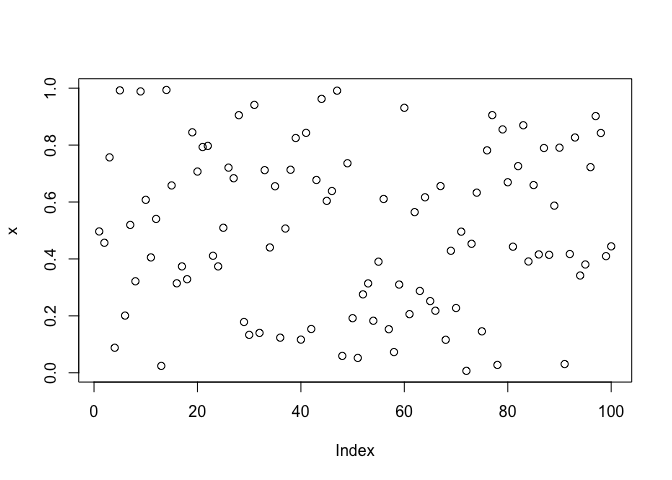

A Test of some stuff
================

Clear environment and load packages

``` r
rm(list=ls())
gc()
```

    ##          used (Mb) gc trigger (Mb) max used (Mb)
    ## Ncells 487118 26.1     940480 50.3   750400 40.1
    ## Vcells 916821  7.0    1650153 12.6  1136900  8.7

``` r
library(RColorBrewer)
library(dplyr)
library(gdata)
library(wordcloud)
library(tm)
```

Example

``` r
x <- runif(100)
plot(x)
```


